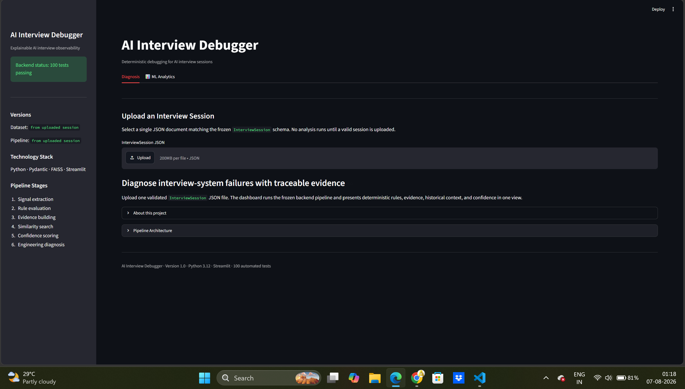
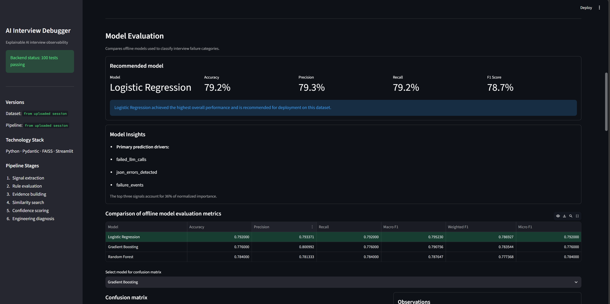
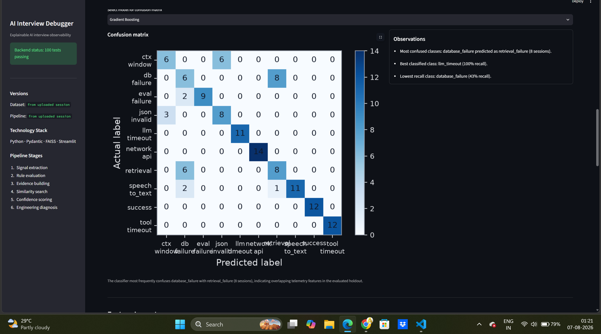
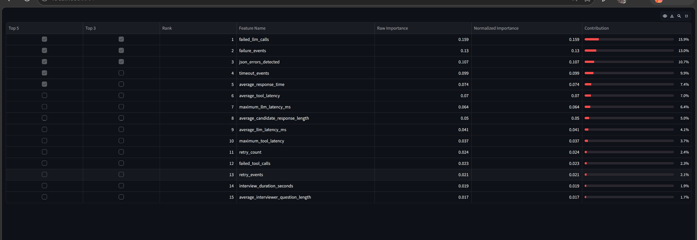
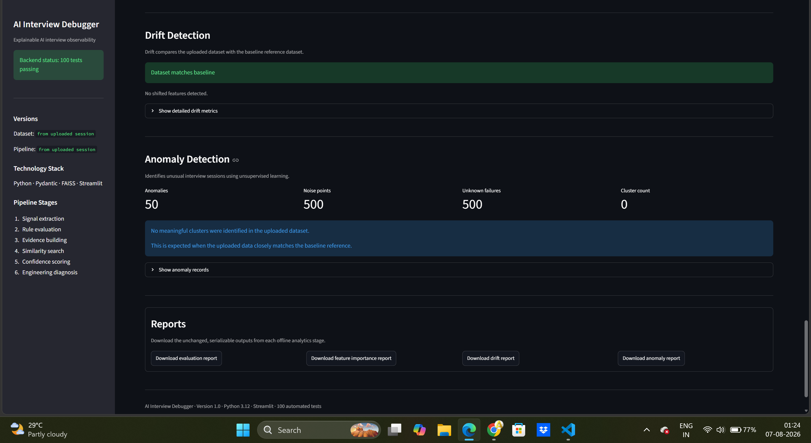
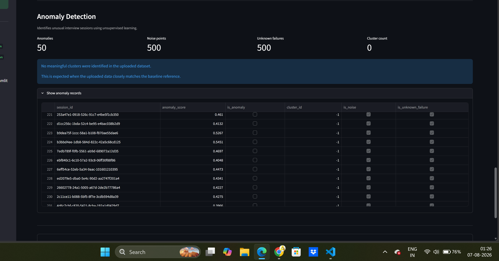

# AI Interview Debugger

> An explainable observability and offline analytics workspace for diagnosing failures in AI-assisted interview workflows.

[](https://www.python.org/)
[](https://streamlit.io/)
[](https://scikit-learn.org/)
[](https://docs.pytest.org/)
[](#)

AI interview platforms depend on several moving parts: transcripts, LLM calls, retrieval and evaluation tools, timelines, and downstream scoring. When an interview fails, raw logs alone make it difficult to determine what happened and why. AI Interview Debugger turns one typed interview session into measurable signals, deterministic rule results, traceable evidence, historical similarity matches, a confidence score, and a structured engineering diagnosis.

The project keeps runtime diagnosis deterministic and inspectable. Its separate offline ML analytics layer complements that reasoning with model evaluation, explainability, distribution drift, and anomaly discovery over historical synthetic sessions. The two layers are intentionally decoupled: analytics do not alter a live diagnosis.

## Quick Start

1. Clone the repository and install dependencies.
2. Generate the deterministic synthetic dataset: `python generate_dataset.py --out data/synthetic --n 400 --seed 42`.
3. Launch the dashboard: `streamlit run app/app.py`.
4. In **Diagnosis**, upload one JSON example from `examples/`.
5. In **ML Analytics**, upload `data/synthetic/interview_sessions.jsonl` or `data/synthetic/interview_sessions.csv` and run analytics.
6. Review the results and download the JSON reports from the **Reports** section.

---

## Highlights

| Area | Implementation |
| --- | --- |
| Purpose | Debug and observe AI interview-system failures from typed session telemetry. |
| Language | Python 3.12 with Pydantic v2 models and type hints. |
| Dashboard | Streamlit interface for single-session diagnosis and dataset-level ML analytics. |
| Diagnosis | Signal extraction, deterministic rules, evidence, FAISS similarity, confidence, and template reasoning. |
| ML models | Logistic Regression, Random Forest, and Gradient Boosting classifiers. |
| Explainability | Native/tree, coefficient, and deterministic permutation feature importance. |
| Monitoring | Jensen-Shannon divergence, Population Stability Index (PSI), Isolation Forest, and DBSCAN. |
| Testing | 100 automated pytest tests across the pipeline, generator, ML modules, and dashboard helpers. |
| Current version | v1.0 |

## Key Features

| Capability | What it provides |
| --- | --- |
| Deterministic diagnosis | Converts an `InterviewSession` into a `FailureDiagnosis` without external API calls. |
| Structured telemetry | Captures transcript turns, LLM calls, tool calls, timeline events, metrics, trace IDs, stages, and version metadata. |
| Rule evaluation | Evaluates ten centralized-threshold rules, including latency, failed calls, retries, JSON errors, token usage, and transcript activity. |
| Traceable evidence | Produces source-linked `EvidenceRecord` objects for every triggered rule. |
| Similarity search | Retrieves comparable historical sessions with a normalized numerical FAISS index. |
| Confidence scoring | Combines triggered-rule strength, evidence completeness/severity, and historical agreement into a bounded score. |
| Offline model evaluation | Uses a deterministic stratified holdout split and ranks classifiers by macro F1. |
| Feature importance | Reports raw, normalized, and ranked signal importance using estimator-compatible methods. |
| Drift detection | Compares feature distributions with Jensen-Shannon divergence and PSI, plus label-distribution changes. |
| Anomaly detection | Uses Isolation Forest and DBSCAN to flag outliers, noise, and potential unknown failures. |
| Synthetic data | Generates 300–500 realistic, schema-valid interview sessions with representative failure cascades. |
| Exportable reports | Keeps evaluation, importance, drift, and anomaly outputs JSON-serializable for download. |

---

## System Architecture

```text
Synthetic InterviewSession data
        |
        v
Pydantic validation and traceable telemetry
        |
        +-------------------- Runtime diagnosis --------------------+
        |                                                            |
        v                                                            |
SignalExtractor -> RuleEngine -> EvidenceBuilder -> SimilarityEngine |
        |                                      (FAISS)               |
        v                                                            |
ConfidenceEngine -> TemplateReasoningProvider -> FailureDiagnosis    |
        |                                                            |
        +------------------------------------------------------------+
        |
        +-------------------- Offline ML analytics -----------------+
        |                                                            |
        v                                                            |
DatasetLoader (31 stable SignalExtractor-compatible features)        |
        |                                                            |
        +--> ModelEvaluator --> FeatureImportanceAnalyzer            |
        +--> DriftDetector                                           |
        +--> AnomalyDetector                                         |
        |
        v
Streamlit dashboard and JSON report downloads
```

### Stage responsibilities

1. **Synthetic data** creates realistic, versioned interview sessions and ground-truth failure labels.
2. **Signal extraction** computes observable counts, latencies, token usage, transcript statistics, and indicator flags; it does not infer a root cause.
3. **Rules and evidence** apply deterministic thresholds from `config.py` and attach source-linked supporting records.
4. **Similarity and confidence** retrieve comparable historical vectors and calculate a reproducible confidence result.
5. **Template reasoning** maps deterministic inputs to the schema-supported engineering diagnosis. The default provider is local and does not call an external LLM.
6. **Offline analytics** uses the same stable signal contract for historical evaluation and monitoring, without changing the runtime diagnosis path.

> [!IMPORTANT]
> The diagnosis pipeline and ML analytics are separate by design. Model evaluation, drift, and anomaly results are offline analytical outputs; they do not influence deterministic rule evaluation or confidence scoring.

---

## Input Dataset

Every generated record represents one interview session. A full session can contain:

- Candidate profile and interview role metadata
- Interview stages and transcript turns
- LLM prompts, responses, latency, duration, token counts, status, and errors
- Tool-call inputs/outputs, duration, status, and errors
- Chronological timeline events, retries, and failure events
- Session metrics, traceability identifiers, and schema/dataset/pipeline versions
- Synthetic `GroundTruth` labels for evaluation only

The generator produces the following files in `data/synthetic/`:

| File | Format and intended use |
| --- | --- |
| `interview_sessions.jsonl` | Authoritative newline-delimited JSON. Each line is one complete nested, schema-valid `InterviewSession`; use it for backend processing and complete ML feature extraction. |
| `interview_sessions.csv` | Flattened session-level projection for quick inspection and CSV upload. It contains the same generated session population and session IDs, but not the nested transcript or call records preserved in JSONL. |

Both exports are produced from the same generation run; the difference is the serialization detail available in each format. The generator also writes ready-to-upload examples to `examples/`:

- `healthy_session.json`
- `llm_timeout.json`
- `tool_timeout.json`
- `mixed_failure.json` (when a generated session has multiple failed calls)

### Diagnosis tab workflow

The **Diagnosis** tab accepts **one complete `InterviewSession` JSON file**. The files in `examples/`—`healthy_session.json`, `llm_timeout.json`, `tool_timeout.json`, and `mixed_failure.json`—are ready-to-upload demonstrations of deterministic diagnosis. They validate against the frozen Pydantic schema before the pipeline runs.

### ML Analytics tab workflow

The **ML Analytics** tab accepts the generated CSV or JSONL dataset. Each row in CSV, and each line/session in JSONL, represents one generated interview session from the same dataset population. The dashboard loads and validates the upload before running offline analytics; JSONL enables complete signal extraction, while CSV supports the flattened fields exported by the generator.

## Failure scenarios in the synthetic data

The default generator creates successful interviews and injects realistic failures such as speech-to-text degradation, LLM timeout, tool timeout, invalid JSON, context-window overflow, retrieval failure, evaluation failure, network/API failure, and database failure. Some sessions include retry or propagation effects across components. The predicted `diagnosis` field is intentionally left empty in generated data; only `ground_truth` is populated.

---

## Application Workflow

1. **Generate a deterministic dataset** with the default 400 sessions and seed 42.
2. **Launch Streamlit** from the repository root.
3. **Upload one example JSON file** in the Diagnosis tab to validate and run the frozen diagnosis pipeline.
4. **Upload a JSONL or CSV dataset** in the ML Analytics tab (or use the available sample dataset) and run the offline workflow.
5. **Review model, feature, drift, and anomaly outputs** in the dashboard.
6. **Download JSON reports** for evaluation, feature importance, drift, or anomaly results.

```powershell
# 1. Generate synthetic data and dashboard-ready examples
python generate_dataset.py --out data/synthetic --n 400 --seed 42

# 2. Start the dashboard
streamlit run app/app.py
```

---

```text
Synthetic Dataset
        |
        v
Diagnosis (single JSON)
        |
        v
Engineering Diagnosis
        |
        v
ML Analytics (CSV / JSONL)
        |
        +-- Model Evaluation
        +-- Feature Importance
        +-- Drift Detection
        +-- Anomaly Detection
        |
        v
JSON Reports
```

## Dashboard Walkthrough

### 1. Dashboard Home



The landing view separates **Diagnosis** from **ML Analytics**. The Diagnosis tab accepts one JSON document matching the frozen `InterviewSession` schema and validates it before any work runs. Its sidebar presents project status, technology stack, pipeline stages, and uploaded-session version metadata once a session is loaded.

Use the supplied files in `examples/` to exercise the diagnosis flow immediately. The resulting page exposes root cause, severity, confidence, triggered rules, evidence, similar-session results, the timeline, and an execution summary. This layout makes it possible to distinguish measured facts from the final diagnosis rather than treating a single generated explanation as the source of truth.

### 2. Model Evaluation



The ML Analytics workflow validates the dataset, builds a stable 31-feature matrix, and evaluates Logistic Regression, Random Forest, and Gradient Boosting using a deterministic stratified train/test split. The comparison table reports accuracy, weighted precision and recall, macro F1, weighted F1, and micro F1; models are ranked by macro F1.

Accuracy summarizes total correct predictions, while precision and recall make different failure modes visible. F1 combines those trade-offs, and macro F1 prevents frequent classes from dominating the ranking. The recommended model card surfaces the winning model and its primary holdout metrics so users can evaluate the recommendation in context rather than relying on a model name alone.

### 3. Confusion Matrix



The selected model’s confusion matrix provides class-wise prediction counts. Diagonal cells are correct classifications; off-diagonal cells show which failure categories are confused. The dashboard uses compact display labels for dense matrices while retaining the original report labels and a deterministic observations panel.

This view is useful when a reasonable aggregate F1 score conceals a weak class. Frequent confusion between two scenarios can indicate overlapping signal patterns, insufficiently distinctive telemetry, or class imbalance in the available historical data. The panel beside the matrix identifies the largest confusion and the best and worst recall classes directly from the matrix.

### 4. Feature Importance



Feature importance ranks the stable extracted signals used by a fitted classifier. Tree models expose native importances; linear models use absolute normalized coefficients; permutation importance is available with a fixed random state and repeat count. The dashboard shows rank, raw importance, normalized importance, contribution percentage, and Top-3/Top-5 markers.

Raw values show the estimator-specific magnitude, while normalized values express each signal’s share of total measured importance. This makes the model more auditable: users can see whether predictions depend mostly on latency and failure telemetry, transcript activity, or other observable signals. Importance is explanatory context for offline models, not a runtime diagnosis rule.

### 5. Drift Detection



Drift analysis compares an uploaded ML dataset with the repository’s baseline reference dataset. It calculates Jensen-Shannon divergence and PSI for each stable feature, then compares root-cause, failure-category, and affected-component label distributions in percentage points. The summary includes shifted-feature count, largest and average drift, and overall drift score.

When the provided synthetic dataset is compared with itself, it shows negligible drift: the dashboard presents a concise baseline-match state and moves detailed label metrics into an expander. In production, a material shift is a signal to investigate changes in traffic, instrumentation, model behavior, or upstream services before relying on historical evaluation results.

### 6. Anomaly Detection



Anomaly detection operates on the existing feature matrix after median imputation and standardization. Isolation Forest produces anomaly scores and flags; DBSCAN provides cluster IDs, noise points, and cluster statistics. A session is also marked as a potential unknown failure when it is an outlier, noise, or belongs to an isolated cluster.

The dashboard reports total anomalies, noise points, unknown-failure candidates, and meaningful cluster count. Expandable anomaly records retain the session-level details for investigation. A dataset that closely matches the baseline may not contain enough separable structure for meaningful clustering; that is an expected result, not an application error.

---

## Generated Reports

The **Reports** panel in ML Analytics downloads the existing offline outputs as JSON. Each payload is JSON serializable and can be stored, versioned, or consumed by external engineering workflows without re-running the dashboard.

| Report | Contents |
| --- | --- |
| Model Evaluation Report | Per-model holdout metrics, class labels, confusion matrices, ranking, and best-model metadata. |
| Feature Importance Report | Ranked feature scores, normalized contributions, summary statistics, and importance-method metadata. |
| Drift Detection Report | Per-feature Jensen-Shannon divergence and PSI, label-distribution changes, and aggregate drift summary. |
| Anomaly Detection Report | Per-session anomaly scores and flags, DBSCAN cluster assignments, cluster statistics, and unknown-failure candidates. |

---

## Repository Structure

```text
AI-Interview-Debugger/
├── app/
│   ├── app.py                    # Streamlit entry point and diagnosis presentation
│   └── ml_analytics.py           # ML analytics workflow, report views, and downloads
├── assets/                       # README dashboard screenshots
├── data/
│   └── synthetic/                # Generated JSONL and CSV session exports
├── docs/                         # Documentation conventions and future design notes
├── examples/                     # Single-session JSON files for the Diagnosis tab
├── ml/                           # Offline loading, evaluation, explainability, drift, anomaly modules
├── models/                       # Package namespace for future embedding/index wrappers
├── pipeline/                     # Frozen schema and deterministic diagnosis pipeline stages
├── tests/                        # Pytest coverage for runtime, ML, generator, and UI helpers
├── utils/                        # Package namespace for common helpers
├── config.py                     # Central deterministic thresholds and filesystem configuration
├── generate_dataset.py           # Deterministic synthetic data generator CLI
└── requirements.txt              # Runtime and development dependencies
```

## Technology Stack

| Technology | Role in this repository |
| --- | --- |
| Python 3.12 | Application, data generation, pipeline, and tests. |
| Pydantic | Typed, nested `InterviewSession` schema validation and serialization. |
| Streamlit | Interactive diagnosis and ML analytics dashboard. |
| NumPy and pandas | Feature matrices, numerical operations, and dashboard tables. |
| scikit-learn | Classifiers, metrics, feature importance, preprocessing, Isolation Forest, and DBSCAN. |
| FAISS | Normalized numerical similarity retrieval for historical interview sessions. |
| Matplotlib | Confusion matrix and feature-importance plots. |
| Faker (`en_IN`) | Deterministic synthetic candidate profiles. |
| pytest | Automated unit and integration-style verification. |

---

## Installation

```powershell
# Clone the repository
git clone https://github.com/abhijeet8684-beep/AI-Interview-Debugger.git
cd AI-Interview-Debugger

# Create and activate a virtual environment (PowerShell)
python -m venv .venv
.\.venv\Scripts\Activate.ps1

# Install dependencies
python -m pip install --upgrade pip
python -m pip install -r requirements.txt
```

> [!NOTE]
> `faiss-cpu` can require platform-specific installation support. The repository’s `requirements.txt` notes that a conda package or Linux environment may be useful if its wheel is unavailable on Windows.

## Usage

### Generate the dataset

```powershell
python generate_dataset.py --out data/synthetic --n 400 --seed 42
```

The generator accepts `--n` from 300 to 500 and validates every generated `InterviewSession` before writing JSONL, CSV, and representative example files.

### Run the dashboard

```powershell
streamlit run app/app.py
```

### Run an engineering diagnosis

1. Open the **Diagnosis** tab.
2. Upload one file from `examples/`, such as `examples/llm_timeout.json`.
3. Inspect the deterministic rules, supporting evidence, confidence contributors, timeline, and structured diagnosis.

### Run ML analytics

1. Open the **ML Analytics** tab.
2. Upload `data/synthetic/interview_sessions.jsonl` for complete feature extraction, or the flattened CSV for its supported fields.
3. Select **Run ML Analytics**.
4. Review evaluation, feature importance, drift, and anomaly sections.
5. Use the **Reports** section to download JSON outputs.

## Testing

The project has **100 automated pytest tests** covering:

- Pydantic schema-compatible synthetic generation and representative exports
- Signal extraction, deterministic rules, evidence construction, similarity retrieval, confidence, and reasoning
- Full diagnosis orchestration and dashboard data-preparation helpers
- Dataset loading, stable feature ordering, malformed rows, and statistics
- Supervised model evaluation, ranking, metrics, and serialization
- Feature importance, drift detection, anomaly detection, and report exportability

```powershell
python -m pytest -q
```

---

## Future Work

- Add authenticated persistence for generated analytical reports and model metadata.
- Provide configurable baseline datasets and drift-alert thresholds through deployment settings.
- Add calibration and cross-validation views for offline classifiers.
- Support pluggable external reasoning providers while preserving the deterministic default.
- Add CI workflows, release automation, and an explicit open-source license.

## Author

**Abhijeet**

Master of Engineering (Embedded Systems)  
BITS Pilani, K. K. Birla Goa Campus

Passionate about Embedded Systems, Embedded Linux, and AI-driven Software Engineering.

- GitHub: [@abhijeet8684-beep](https://github.com/abhijeet8684-beep)
- LinkedIn: [Abhijeet](https://www.linkedin.com/in/abhijeet-80926537b/)

## Acknowledgements

This project was developed as part of the Master of Engineering (Embedded Systems) journey at BITS Pilani, K. K. Birla Goa Campus. It draws inspiration from modern AI observability, explainable AI, and machine learning engineering practices; it does not imply institutional endorsement.

## License

No license file is currently included in this repository. Add an explicit license before distributing or accepting external contributions.
